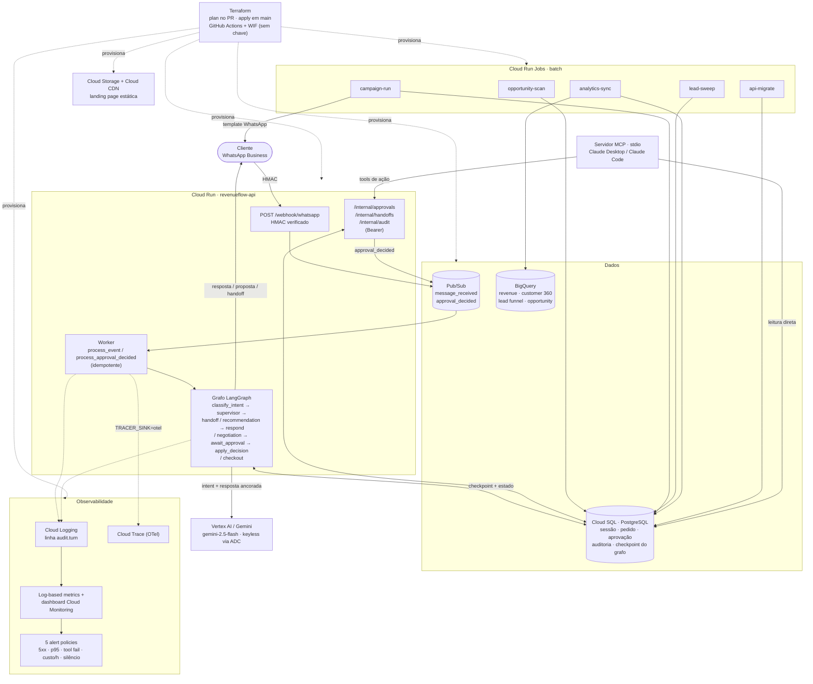
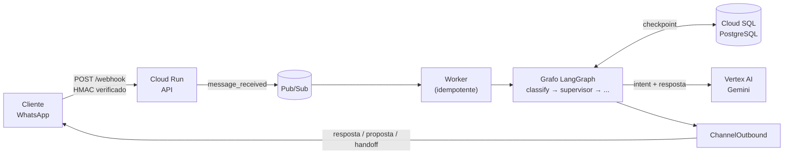

# RevenueFlow AI

**Um agente comercial B2B via WhatsApp que nunca decide preço, estoque ou pagamento sozinho.**

RevenueFlow AI atende, negocia, fecha pedido e reabre conversa por iniciativa própria — tudo sobre
Cloud Run, Cloud SQL, Pub/Sub e Vertex AI/Gemini. O LLM interpreta a mensagem; um **Policy Engine
determinístico** decide o que é permitido; a API executa. Essa não é uma frase de efeito — é a
regra que todo código novo precisa respeitar antes de entrar em `main`.

[](https://github.com/JonatasLimaBR/revenueflow-ai/actions/workflows/ci.yml)
[](https://github.com/JonatasLimaBR/revenueflow-ai/actions/workflows/terraform.yml)

-brightgreen)

---

## Índice

- [Por que este projeto existe](#por-que-este-projeto-existe)
- [Funcionalidades](#funcionalidades)
- [Arquitetura](#arquitetura)
- [Stack tecnológico](#stack-tecnológico)
- [Quick start](#quick-start)
- [Estrutura do repositório](#estrutura-do-repositório)
- [Status do projeto](#status-do-projeto)
- [Documentação completa](#documentação-completa)
- [Contribuindo](#contribuindo)

## Por que este projeto existe

A maioria dos "agentes de IA" comerciais coloca o modelo de linguagem no controle de decisões que
custam dinheiro de verdade — desconto, estoque, pagamento. RevenueFlow AI parte do princípio
oposto: **o LLM nunca é a fonte da verdade**. Ele interpreta a intenção do cliente e redige texto;
toda decisão que move dinheiro passa por uma *policy* Python pura, determinística e testável sem
nenhuma chamada de modelo. O que sai fora da alçada da policy pausa o fluxo e espera um humano —
nunca uma inferência sobre "o que o modelo achou razoável".

## Funcionalidades

17 fatias entregues e em produção, cada uma passada pelo ciclo completo (Brainstorm → Define →
Design → Build → Ship) e mergeada em `main` só depois de todos os checks de CI verdes.

| Fase | Fatia | O que faz |
|---|---|---|
| **1. Atendimento & IA** | `WHATSAPP_INBOUND_SLICE` | Webhook autenticado por HMAC → Pub/Sub → grafo LangGraph classifica a intenção e monta uma resposta ancorada em catálogo/preço/estoque reais — nunca texto solto do modelo. |
| | `WHATSAPP_INBOUND_VERTEX` | Classificação de intenção e resposta passam a chamar **Vertex AI Gemini** de verdade, keyless via ADC. Falha transitória vira retry; exaustão vira handoff fixo, nunca resposta inventada. |
| **2. Negociação & Aprovação** | `PRICING_AND_NEGOTIATION` | Pricing Service determinístico calcula margem e alçada; desconto fora da política **pausa o grafo** (`interrupt()`) e cria uma `Approval(PENDING)`. |
| | `APPROVAL_RESUME` | Rota interna autenticada transiciona a aprovação; o consumidor toma um *advisory lock* por conversa e retoma o grafo exatamente de onde parou. |
| **3. Pedido & Pagamento** | `CHECKOUT` | Confirmação explícita cria o pedido de forma **idempotente**, revalida estoque na hora e roda pagamento em sandbox — zero dado de cartão, zero transação real. |
| **4. Inteligência de Cliente** | `CUSTOMER_360` | Telefone é conferido contra a base de clientes antes de virar lead novo; cliente conhecido ganha uma visão comercial de 365 dias, sem dado bruto ir inteiro para o LLM. |
| | `OPPORTUNITY_ENGINE` | Job em lote, fora do grafo, detecta recompra atrasada e proposta parada por regra pura — cada oportunidade carrega o motivo e a evidência numérica exata. |
| | `LEAD_LIFECYCLE` | Status do lead avança por sinal determinístico (`NEW → QUALIFYING → QUALIFIED → PROPOSAL → WON`); `WON` promove um `Customer` real. Leads sem atividade viram `LOST` em lote. |
| **5. Governança & Operação** | `HUMAN_HANDOFF` | 3 gatilhos determinísticos transferem a conversa — pedido explícito, baixa confiança, alto valor — cada um com precedência fixa. |
| | `AUDIT_TRAIL` | Uma linha de auditoria por turno no próprio banco: agente, modelo, ferramentas, tokens, custo em USD, latência e resultado. |
| | `OBSERVABILITY_OPS` | A auditoria vira log estruturado + métrica de produção: 5 alertas (5xx, p95, falha de ferramenta, custo/h, ausência de tráfego) num dashboard do Cloud Monitoring. |
| | `HARDENING_PERFORMANCE` | Orçamento de tempo por turno: timeout por tentativa no Vertex AI, teto duro no turno inteiro, timeout por consulta no banco. |
| | `HARDENING_SECURITY_PII` | CPF mascarado em todo log; headers de segurança em toda resposta HTTP; suíte que **prova** que uma mensagem adversária não muda alçada, preço, nem pula aprovação. |
| | `DASHBOARD_ACCESS` | Acesso de leitura ao dashboard de observabilidade para outras contas Google, via IAM (`roles/monitoring.viewer`), sem abrir o projeto inteiro. |
| **6. Venda Ativa** | `ACTIVE_SALES` | Job em lote roda um Policy Gate real (opt-out sempre vence, sem opt-in ninguém é contatado, limite de frequência) antes de enviar mensagem via WhatsApp. |
| **7. Analytics & Acesso** | `ANALYTICS` | Revenue Intelligence: receita, margem, receita recuperada e custo de IA sincronizados do Postgres para o BigQuery. |
| | `ANALYTICS_360` | Customer 360, Lead 360, Opportunity 360 e taxa de handoff — os domínios restantes do PRD-015 — no mesmo pipeline. |
| | `MCP_SERVER` | Servidor MCP pessoal (leitura + as operações internas já existentes) para acessar o sistema via Claude Desktop/Claude Code. |

Cada linha acima tem um ADR correspondente documentando o *porquê* — veja [Documentação
completa](#documentação-completa).

## Arquitetura

### Diagrama de arquitetura completo



*(Diagrama versionado como código — [`README.md`](README.md) é a fonte, sem imagem estática pra
ficar desatualizada. Renderiza nativamente no GitHub.)*

### Fluxo de uma mensagem (zoom-in)



### Camadas de dependência

```text
api / agents / worker
        ↓
     services
        ↓
  domain + policies
        ↓
repositories / adapters
```

`agents` nunca acessa o banco diretamente; `policies` são funções puras, testáveis sem LLM e sem
I/O. Ferramenta ausente é controle de segurança — um agente nunca vê uma `tool` que não deveria
existir para ele (ver [SPEC-025](docs/specs/spec-025-tool-permissions.md)).

### Invariantes (não-negociáveis)

- **O LLM não é fonte de verdade** para preço, estoque, margem, identidade, pedido ou pagamento.
- **Tool ausente é controle de segurança** — nunca registrar uma tool proibida "por garantia".
- **Ação irreversível exige checkpoint/aprovação** quando definido em spec.
- **Nunca pagamento real** e **nunca documento fiscal real** nesta versão — sandbox de ponta a ponta.
- **Nenhum guardrail é removido** para fazer um CI passar.
- **Todo turno é auditado** — agente, modelo, ferramentas, custo e resultado, uma linha, sempre.

A lista completa está em [`CLAUDE.md`](CLAUDE.md#invariantes).

## Stack tecnológico

| Camada | Tecnologia | ADR |
|---|---|---|
| Runtime | Python 3.12, FastAPI, Uvicorn | [SPEC-037](docs/specs/spec-037-technology-stack.md) |
| Orquestração de agentes | LangGraph (checkpoint em PostgreSQL) | [ADR-038](docs/adrs/adr-038-langgraph-for-stateful-agent-orchestration.md) |
| LLM | Vertex AI / Gemini (`gemini-2.5-flash`), keyless via ADC | [ADR-049](docs/adrs/adr-049-vertex-ai-via-google-genai.md) |
| OLTP | Cloud SQL (PostgreSQL) — sessão, pedido, aprovação, auditoria, checkpoint do grafo | [ADR-004](docs/adrs/adr-004-postgresql-como-oltp.md) |
| Analytics | BigQuery (sync batch a partir do Postgres) | [ADR-005](docs/adrs/adr-005-bigquery-como-analytics.md) |
| Backbone assíncrono | Pub/Sub | [ADR-006](docs/adrs/adr-006-pub-sub-como-event-backbone.md) |
| Compute | Cloud Run (serviço + Jobs batch) | [ADR-002](docs/adrs/adr-002-cloud-run-como-runtime.md) |
| IaC | Terraform, `plan` comentado em todo PR, `apply` só em `main` | — |
| CD | GitHub Actions + Workload Identity Federation (keyless) | [ADR-048](docs/adrs/adr-048-github-actions-wif-keyless-cd.md) |
| Observabilidade | Log-based metrics + OpenTelemetry → Cloud Trace | [ADR-056](docs/adrs/adr-056-observability-ops-otel-cloud-trace-and-log-metrics.md) |

## Quick start

Requisitos: Docker + Docker Compose, Python 3.12.

```bash
make up          # sobe app + postgres + emulador Pub/Sub + Langfuse (docker-compose)
make migrate     # aplica migrations + setup do checkpointer LangGraph
make seed        # popula o catálogo/estoque simulado
make run         # roda a API local com autoreload (precisa de postgres)
make check       # lint + typecheck + testes + validate_docs (tudo que o CI roda)
```

Por padrão o projeto roda em `LLM_STUB=1` (sem credencial de nuvem necessária) — dev local e CI
usam o stub; produção roda `LLM_STUB=0` contra o Vertex AI real. Detalhes completos de deploy no
[runbook de deploy](docs/engineering/deploy.md).

## Estrutura do repositório

```text
revenueflow-ai/
├── AGENTS.md               # contrato de engenharia compartilhado
├── CLAUDE.md                # regras específicas do harness Claude Code
├── CONTRIBUTING.md
├── src/revenueflow/
│   ├── api/                 # rotas FastAPI (webhook, approvals, handoffs, audit, health)
│   ├── agents/               # nós do grafo LangGraph
│   ├── services/             # orquestração de casos de uso
│   ├── policies/             # regras determinísticas puras (sem I/O, sem LLM)
│   ├── domain/                # enums + dataclasses de entidade
│   ├── repositories/          # acesso a Postgres (pool async psycopg)
│   ├── adapters/               # portas de canal (WhatsApp)
│   ├── tools/                   # tools LangGraph, registries isolados por agente
│   ├── events/                   # EventPublisher (in_memory/pubsub)
│   ├── observability/             # mask() de PII, Tracer, custo, logging, OTel
│   ├── worker/                     # consumidores Pub/Sub idempotentes
│   └── config.py                    # Settings tipado (pydantic-settings)
├── tests/
│   ├── unit/ · integration/ · security/ · ai_eval/
├── scripts/                 # entrypoints dos Cloud Run Jobs batch
├── infra/terraform/         # toda a infraestrutura, versionada
├── migrations/               # SQL sequencial, aplicado por scripts/migrate.py
└── docs/
    ├── prd/                  # 16 Product Requirement Docs
    ├── specs/                # 37 especificações técnicas
    ├── adrs/                 # 63 Architecture Decision Records
    └── engineering/          # harness, estrutura, processo, deploy
```

## Status do projeto

| Métrica | Valor |
|---|---|
| Fatias entregues | 17 (ver tabela de [Funcionalidades](#funcionalidades)) |
| ADRs documentados | 63 |
| PRDs | 16 |
| SPECs | 37 |
| Pagamento real | 0 — sandbox de ponta a ponta ([ADR-029](docs/adrs/adr-029-pagamento-somente-sandbox.md)) |
| Decisão de preço fora do LLM | 100% ([ADR-011](docs/adrs/adr-011-pricing-determin-stico.md)) |
| Deploy | Ativo no GCP (Cloud Run + Cloud SQL + Pub/Sub + BigQuery), CD automático via GitHub Actions |

O estado detalhado — o que cada fatia fez, o que ficou fora de escopo deliberadamente, e as
pendências operacionais restantes — vive em [`CLAUDE.md`](CLAUDE.md#estado-da-implementação), que é
atualizado a cada fatia mergeada.

## Documentação completa

Cada decisão, especificação e requisito de produto tem um arquivo independente — facilita revisão
por Pull Request, histórico Git, e implementação por agentes de código.

<details>
<summary><strong>PRDs — Product Requirement Docs (16)</strong></summary>

- [PRD-001 — Visão e Objetivos do Produto](docs/prd/prd-001-vis-o-e-objetivos-do-produto.md)
- [PRD-002 — Novo Cliente via WhatsApp](docs/prd/prd-002-novo-cliente-via-whatsapp.md)
- [PRD-003 — Cliente Existente e Customer 360](docs/prd/prd-003-cliente-existente-e-customer-360.md)
- [PRD-004 — Catálogo e Recomendação de Produtos](docs/prd/prd-004-cat-logo-e-recomenda-o-de-produtos.md)
- [PRD-005 — Preço, Margem e Negociação](docs/prd/prd-005-pre-o-margem-e-negocia-o.md)
- [PRD-006 — Estoque e Prazo](docs/prd/prd-006-estoque-e-prazo.md)
- [PRD-007 — Propostas Comerciais](docs/prd/prd-007-propostas-comerciais.md)
- [PRD-008 — Pedidos e Confirmação](docs/prd/prd-008-pedidos-e-confirma-o.md)
- [PRD-009 — Human-in-the-Loop](docs/prd/prd-009-human-in-the-loop.md)
- [PRD-010 — Opportunity Engine](docs/prd/prd-010-opportunity-engine.md)
- [PRD-011 — Venda Ativa via WhatsApp](docs/prd/prd-011-venda-ativa-via-whatsapp.md)
- [PRD-012 — Arquitetura Multiagente](docs/prd/prd-012-arquitetura-multiagente.md)
- [PRD-013 — Observabilidade, Auditoria e Custos de IA](docs/prd/prd-013-observabilidade-auditoria-e-custos-de-ia.md)
- [PRD-014 — Segurança e Privacidade](docs/prd/prd-014-seguran-a-e-privacidade.md)
- [PRD-015 — Analytics e Revenue Intelligence](docs/prd/prd-015-analytics-e-revenue-intelligence.md)
- [PRD-016 — Escopo e Critérios da V1](docs/prd/prd-016-escopo-e-crit-rios-da-v1.md)

</details>

<details>
<summary><strong>SPECs — Especificações Técnicas (37)</strong></summary>

- [SPEC-001 — WhatsApp Webhook](docs/specs/spec-001-whatsapp-webhook.md)
- [SPEC-002 — Conversation Session](docs/specs/spec-002-conversation-session.md)
- [SPEC-003 — Identificação do Cliente](docs/specs/spec-003-identifica-o-do-cliente.md)
- [SPEC-004 — Lead Creation](docs/specs/spec-004-lead-creation.md)
- [SPEC-005 — Intent Classification](docs/specs/spec-005-intent-classification.md)
- [SPEC-006 — Product Search](docs/specs/spec-006-product-search.md)
- [SPEC-007 — Product Recommendation](docs/specs/spec-007-product-recommendation.md)
- [SPEC-008 — Inventory Service](docs/specs/spec-008-inventory-service.md)
- [SPEC-009 — Pricing Service](docs/specs/spec-009-pricing-service.md)
- [SPEC-010 — Pricing Guardrail](docs/specs/spec-010-pricing-guardrail.md)
- [SPEC-011 — Negotiation Agent](docs/specs/spec-011-negotiation-agent.md)
- [SPEC-012 — Human Approval](docs/specs/spec-012-human-approval.md)
- [SPEC-013 — Quote](docs/specs/spec-013-quote.md)
- [SPEC-014 — Confirmation](docs/specs/spec-014-confirmation.md)
- [SPEC-015 — Order](docs/specs/spec-015-order.md)
- [SPEC-016 — Payment Sandbox](docs/specs/spec-016-payment-sandbox.md)
- [SPEC-017 — Customer 360](docs/specs/spec-017-customer-360.md)
- [SPEC-018 — Opportunity Engine](docs/specs/spec-018-opportunity-engine.md)
- [SPEC-019 — Replenishment Rule](docs/specs/spec-019-replenishment-rule.md)
- [SPEC-020 — Quote Recovery](docs/specs/spec-020-quote-recovery.md)
- [SPEC-021 — Opportunity Entity](docs/specs/spec-021-opportunity-entity.md)
- [SPEC-022 — Outbound Contact](docs/specs/spec-022-outbound-contact.md)
- [SPEC-023 — Agent Supervisor](docs/specs/spec-023-agent-supervisor.md)
- [SPEC-024 — Allowed Agents](docs/specs/spec-024-allowed-agents.md)
- [SPEC-025 — Tool Permissions](docs/specs/spec-025-tool-permissions.md)
- [SPEC-026 — Human Handoff](docs/specs/spec-026-human-handoff.md)
- [SPEC-027 — Handoff Context](docs/specs/spec-027-handoff-context.md)
- [SPEC-028 — Audit Trail](docs/specs/spec-028-audit-trail.md)
- [SPEC-029 — Grounding](docs/specs/spec-029-grounding.md)
- [SPEC-030 — Security](docs/specs/spec-030-security.md)
- [SPEC-031 — PII](docs/specs/spec-031-pii.md)
- [SPEC-032 — Prompt Injection](docs/specs/spec-032-prompt-injection.md)
- [SPEC-033 — Idempotency](docs/specs/spec-033-idempotency.md)
- [SPEC-034 — Observability](docs/specs/spec-034-observability.md)
- [SPEC-035 — Performance](docs/specs/spec-035-performance.md)
- [SPEC-036 — Testing](docs/specs/spec-036-testing.md)
- [SPEC-037 — Technology Stack](docs/specs/spec-037-technology-stack.md)

</details>

<details>
<summary><strong>ADRs — Architecture Decision Records (63)</strong></summary>

- [ADR-001 — GCP como cloud principal](docs/adrs/adr-001-gcp-como-cloud-principal.md)
- [ADR-002 — Cloud Run como runtime](docs/adrs/adr-002-cloud-run-como-runtime.md)
- [ADR-003 — Monólito modular na V1](docs/adrs/adr-003-mon-lito-modular-na-v1.md)
- [ADR-004 — PostgreSQL como OLTP](docs/adrs/adr-004-postgresql-como-oltp.md)
- [ADR-005 — BigQuery como analytics](docs/adrs/adr-005-bigquery-como-analytics.md)
- [ADR-006 — Pub/Sub como event backbone](docs/adrs/adr-006-pub-sub-como-event-backbone.md)
- [ADR-007 — Arquitetura multiagente](docs/adrs/adr-007-arquitetura-multiagente.md)
- [ADR-008 — Least privilege para agentes](docs/adrs/adr-008-least-privilege-para-agentes.md)
- [ADR-009 — LLM não é System of Record](docs/adrs/adr-009-llm-n-o-system-of-record.md)
- [ADR-010 — RAG apenas para conteúdo não estruturado](docs/adrs/adr-010-rag-apenas-para-conte-do-n-o-estruturado.md)
- [ADR-011 — Pricing determinístico](docs/adrs/adr-011-pricing-determin-stico.md)
- [ADR-012 — Negotiation Agent limitado](docs/adrs/adr-012-negotiation-agent-limitado.md)
- [ADR-013 — Human-in-the-Loop](docs/adrs/adr-013-human-in-the-loop.md)
- [ADR-014 — Separar AI Decision de Business Decision](docs/adrs/adr-014-separar-ai-decision-de-business-decision.md)
- [ADR-015 — WhatsApp como primeiro canal](docs/adrs/adr-015-whatsapp-como-primeiro-canal.md)
- [ADR-016 — Core independente do WhatsApp](docs/adrs/adr-016-core-independente-do-whatsapp.md)
- [ADR-017 — Lead scoring por regras](docs/adrs/adr-017-lead-scoring-por-regras.md)
- [ADR-018 — ML após histórico suficiente](docs/adrs/adr-018-ml-ap-s-hist-rico-suficiente.md)
- [ADR-019 — Opportunity Engine separado do Sales Agent](docs/adrs/adr-019-opportunity-engine-separado-do-sales-agent.md)
- [ADR-020 — Outbound exige Policy Gate](docs/adrs/adr-020-outbound-exige-policy-gate.md)
- [ADR-021 — Idempotência obrigatória](docs/adrs/adr-021-idempot-ncia-obrigat-ria.md)
- [ADR-022 — Observabilidade completa dos agentes](docs/adrs/adr-022-observabilidade-completa-dos-agentes.md)
- [ADR-023 — AI Cost como KPI de negócio](docs/adrs/adr-023-ai-cost-como-kpi-de-neg-cio.md)
- [ADR-024 — Prompt injection não altera regras](docs/adrs/adr-024-prompt-injection-n-o-altera-regras.md)
- [ADR-025 — Tools financeiras determinísticas](docs/adrs/adr-025-tools-financeiras-determin-sticas.md)
- [ADR-026 — Databricks Free fora do caminho crítico](docs/adrs/adr-026-databricks-free-fora-do-caminho-cr-tico.md)
- [ADR-027 — GCP como System of Record](docs/adrs/adr-027-gcp-como-system-of-record.md)
- [ADR-028 — Dados simulados primeiro](docs/adrs/adr-028-dados-simulados-primeiro.md)
- [ADR-029 — Pagamento somente sandbox](docs/adrs/adr-029-pagamento-somente-sandbox.md)
- [ADR-030 — Documento comercial simulado](docs/adrs/adr-030-documento-comercial-simulado.md)
- [ADR-031 — Security by Design](docs/adrs/adr-031-security-by-design.md)
- [ADR-032 — PII minimization](docs/adrs/adr-032-pii-minimization.md)
- [ADR-033 — Customer 360 não vai inteiro ao LLM](docs/adrs/adr-033-customer-360-n-o-vai-inteiro-ao-llm.md)
- [ADR-034 — Explicabilidade comercial](docs/adrs/adr-034-explicabilidade-comercial.md)
- [ADR-035 — Receita como principal métrica](docs/adrs/adr-035-receita-como-principal-m-trica.md)
- [ADR-036 — Autonomia proporcional ao risco](docs/adrs/adr-036-autonomia-proporcional-ao-risco.md)
- [ADR-037 — Security by Architecture for Tool Permissions](docs/adrs/adr-037-security-by-architecture-for-tool-permissions.md)
- [ADR-038 — LangGraph for Stateful Agent Orchestration](docs/adrs/adr-038-langgraph-for-stateful-agent-orchestration.md)
- [ADR-039 — Persistent Interrupt Before Irreversible Actions](docs/adrs/adr-039-persistent-interrupt-before-irreversible-actions.md)
- [ADR-040 — Observability From First Functional Slice](docs/adrs/adr-040-observability-from-first-functional-slice.md)
- [ADR-041 — Independent Spec Verification Ritual](docs/adrs/adr-041-independent-spec-verification-ritual.md)
- [ADR-042 — Google Cloud CLI Remote MCP for Developer Harness](docs/adrs/adr-042-google-cloud-cli-remote-mcp-for-developer-harness.md)
- [ADR-043 — Claude Code Hooks Block Destructive GCP Actions](docs/adrs/adr-043-claude-code-hooks-block-destructive-gcp-actions.md)
- [ADR-044 — Pub/Sub para processamento assíncrono do webhook](docs/adrs/adr-044-pub-sub-async-webhook-with-publisher-port.md)
- [ADR-045 — Langfuse self-hosted atrás de uma porta Tracer](docs/adrs/adr-045-langfuse-self-hosted-behind-tracer-port.md)
- [ADR-046 — Docker Compose e Makefile como harness de desenvolvimento](docs/adrs/adr-046-docker-compose-and-makefile-dev-harness.md)
- [ADR-047 — Cloud Run consome o Pub/Sub por pull](docs/adrs/adr-047-cloud-run-consumes-pub-sub-by-pull-with-min-instance.md)
- [ADR-048 — CD via GitHub Actions + WIF, sem chave](docs/adrs/adr-048-github-actions-wif-keyless-cd.md)
- [ADR-049 — Vertex AI via google-genai](docs/adrs/adr-049-vertex-ai-via-google-genai.md)
- [ADR-050 — Retomada da aprovação via rota interna + evento Pub/Sub](docs/adrs/adr-050-approval-resume-via-internal-route-and-event.md)
- [ADR-051 — Checkout Agent determinístico](docs/adrs/adr-051-checkout-agent-deterministic.md)
- [ADR-052 — Customer 360: identidade determinística + visão comercial limitada](docs/adrs/adr-052-customer-360-identity-and-bounded-view.md)
- [ADR-053 — Opportunity Engine determinístico](docs/adrs/adr-053-opportunity-engine-deterministic-batch.md)
- [ADR-054 — Human Handoff: gatilhos determinísticos](docs/adrs/adr-054-human-handoff-deterministic-triggers-and-context.md)
- [ADR-055 — Audit Trail: AuditTracer envolve o sink](docs/adrs/adr-055-audit-trail-tracer-sink-wrapper.md)
- [ADR-056 — OBSERVABILITY_OPS: OTel → Cloud Trace + log-based metrics](docs/adrs/adr-056-observability-ops-otel-cloud-trace-and-log-metrics.md)
- [ADR-057 — Orçamento de latência](docs/adrs/adr-057-latency-budget-per-dependency-timeout-and-turn-cap.md)
- [ADR-058 — HARDENING_SECURITY_PII](docs/adrs/adr-058-security-pii-hardening-pass.md)
- [ADR-059 — ACTIVE_SALES: Policy Gate de contato ativo](docs/adrs/adr-059-active-sales-outbound-policy-gate.md)
- [ADR-060 — LANDING_PAGE: hosting estático GCS + Cloud CDN](docs/adrs/adr-060-landing-page-gcs-cdn.md)
- [ADR-061 — ANALYTICS: sync batch Postgres → BigQuery](docs/adrs/adr-061-analytics-bigquery-revenue-cost.md)
- [ADR-062 — LEAD_LIFECYCLE: transições determinísticas de status](docs/adrs/adr-062-lead-lifecycle-deterministic-transitions.md)
- [ADR-063 — ANALYTICS_360: os 4 domínios restantes do PRD-015](docs/adrs/adr-063-analytics-360-remaining-prd015-domains.md)

</details>

## Contribuindo

O harness oficial de engenharia é **Codex**, dirigido por [`AGENTS.md`](AGENTS.md). A `main` é
protegida — mudanças entram só por Pull Request, com 7 checks obrigatórios (docs, lint, typecheck,
tests, security, pre-commit, pr-title) e merge squash-only.

- [Guia de contribuição](CONTRIBUTING.md)
- [Agent Harness](docs/engineering/agent-harness.md)
- [Estrutura do Repositório](docs/engineering/repository-structure.md)
- [Processo Visível](docs/engineering/visible-process.md)
- [Política de Revisão](docs/engineering/review-policy.md)
- [Arquitetura Agentic](docs/engineering/agentic-architecture.md)
- [Matriz de Permissões de Tools](docs/engineering/tool-permission-matrix.md)
- [Deploy no GCP — Runbook](docs/engineering/deploy.md)

### GCP + Claude Code Dev Kit

Este repositório também inclui um harness [Claude Code](https://claude.com/claude-code) completo
para GCP — [`CLAUDE.md`](CLAUDE.md), [guia do Dev Kit](GCP_CLAUDE_CODE_DEV_KIT.md), `.mcp.json`,
`.claude/skills/`, `.claude/agents/`, `.claude/commands/` e `.claude/hooks/`. O MCP principal é o
Google Cloud CLI remote MCP; ações destrutivas são bloqueadas por hook e continuam sujeitas a IAM e
aprovação humana.
